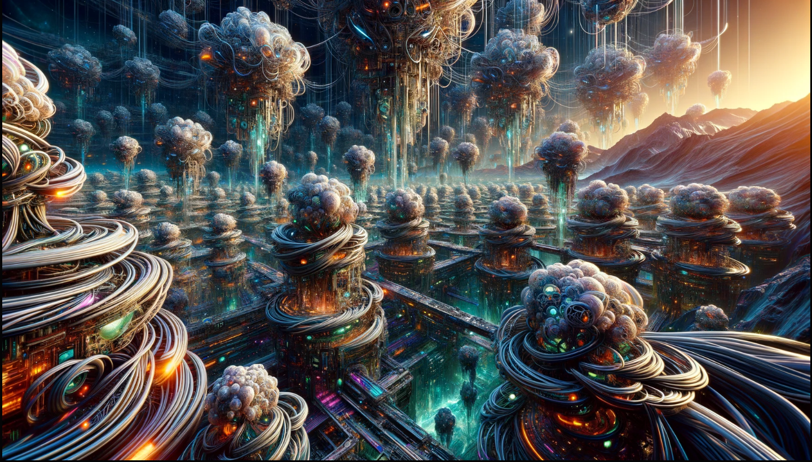

## Metal-Poor Universe

In the infancy of our cosmos, a time when galaxies were still in their formative stages, our universe stood in stark contrast to the metal-rich environment we know today. The early universe was defined by a profound scarcity of heavy metals, setting the stage for a dramatically different tapestry of existence.

But why was this early universe metal-poor? To grasp this concept, we must journey back to the very dawn of time. In those primordial moments following the Big Bang, the universe was a cauldron of superheated particles, a cosmic forge where the first elements were born. Hydrogen and helium reigned supreme, their simplicity painting the canvas of creation.

In this elemental crucible, stars emerged as the alchemists of the cosmos, fusing these primordial gases into heavier elements. Yet, in the early epochs, these stellar forges had not yet produced an abundance of the heavier metals we find in the universe today. The cosmos was, quite literally, in its infancy, and the periodic table was far from fully populated.

This scarcity of heavy metals would leave an indelible mark on the development of life and civilization in this nascent universe. It led to a profound shift in the way inhabitants of this realm approached technology, energy, and even the very essence of life itself.

Let's venture into the uncharted territories of a metal-poor universe, where innovation knows no bounds, and the absence of metals fuels ingenuity beyond imagination.

Here are some speculative ideas:
In the early stages of a universe, technology and the very nature of life and civilization differ significantly from what we are familiar with in our metal-rich "old" universe.

- **Biological Technology:** Life forms in this universe heavily rely on bioengineering and genetic manipulation for adaptation and survival. Organic-based technology is prevalent, with organisms serving as the foundation for advanced systems.

- **Gravitational Tech:** In the absence of abundant metals, civilizations harness the power of gravity for communication and energy generation, potentially utilizing gravitons or other exotic particles.

- **Plasma and Gas-Based Electronics:** Instead of traditional silicon-based electronics, technologies in this universe are based on ionized gases or plasmas, which conduct electricity without depending on metals.

- **Crystal-Based Computing:** Crystals and minerals, abundant even in metal-poor environments, are used for advanced computing, leveraging their quantum properties.

- **Bioluminescent Communication:** Communication relies on bioluminescence, where organisms or devices emit light signals for information exchange.

- **Nuclear Energy:** Nuclear reactions, particularly fusion, play a more significant role in energy generation without the need for heavy metals as fuel.

- **Primitive Mechanical Tech:** Basic mechanical systems are more prominent, relying on materials like wood or other non-metallic substances.

- **Chemical and Organic Materials:** Chemical reactions and organic compounds replace metal-based processes in manufacturing and energy production.

In this early universe, the conditions may have been conducive to the emergence of life, given the scarcity of heavy metals. This unique environment presents a set of technological adaptations and innovations driven by the need for alternative solutions.

A metal-poor universe, technology would likely be quite different from what we're familiar with in our metal-rich universe. Here are some speculative ideas:

Biological Technology: Life forms might rely heavily on bioengineering and genetic manipulation to adapt and survive. Organic-based technology could be prevalent, with organisms serving as the basis for advanced systems.

Gravitational Tech: Without metals, electromagnetism might be less useful. Instead, civilizations could harness the power of gravity for communication and energy generation, possibly using gravitons or other exotic particles.

Plasma and Gas-Based Electronics: Instead of traditional silicon-based electronics, they might develop technologies based on ionized gases or plasmas, which can conduct electricity without relying on metals.

Crystal-Based Computing: Crystals and minerals, abundant even in metal-poor environments, might be used for computation. Quantum properties of crystals could enable advanced computing.

Bioluminescent Communication: Communication could rely on bioluminescence, with organisms or devices emitting light signals for information exchange.

Nuclear Energy: Nuclear reactions, especially fusion, might play a more significant role in energy generation without the need for heavy metals as fuel.

Primitive Mechanical Tech: Basic mechanical systems could be more prominent, relying on materials like wood or other non-metallic substances.

Chemical and Organic Materials: Chemical reactions and organic compounds might replace metal-based processes in manufacturing and energy production.

